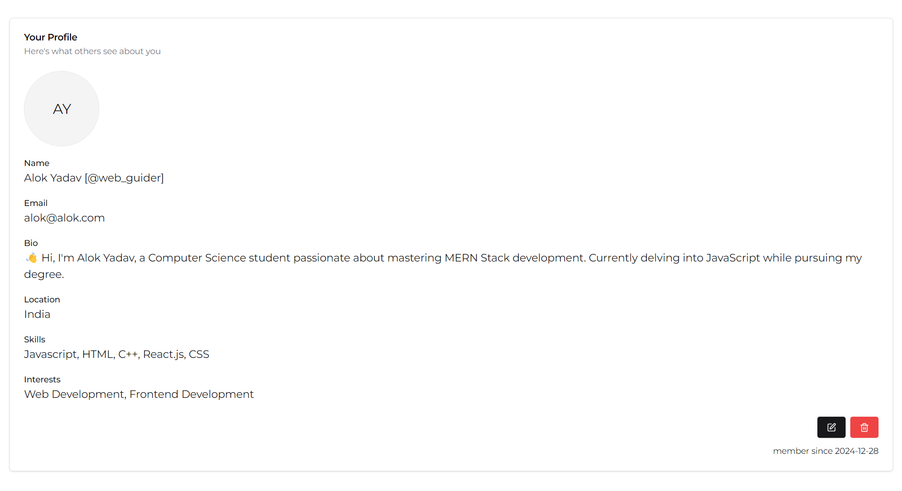
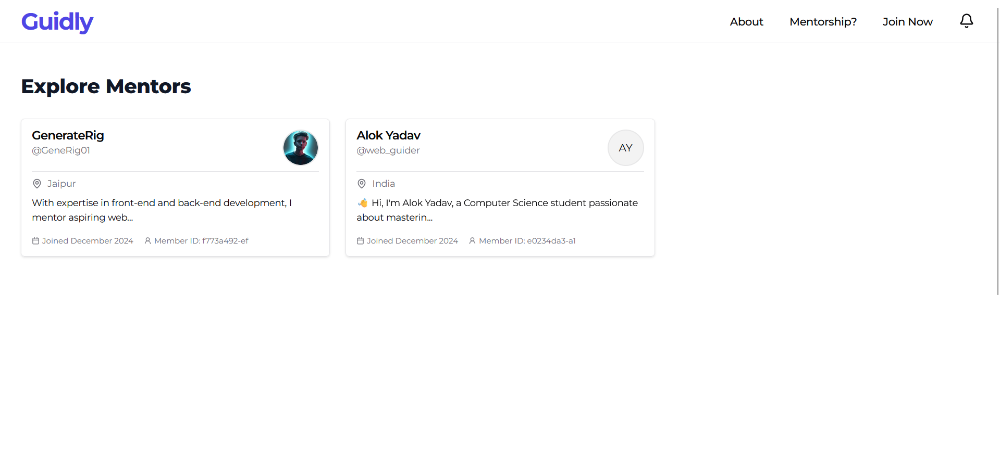
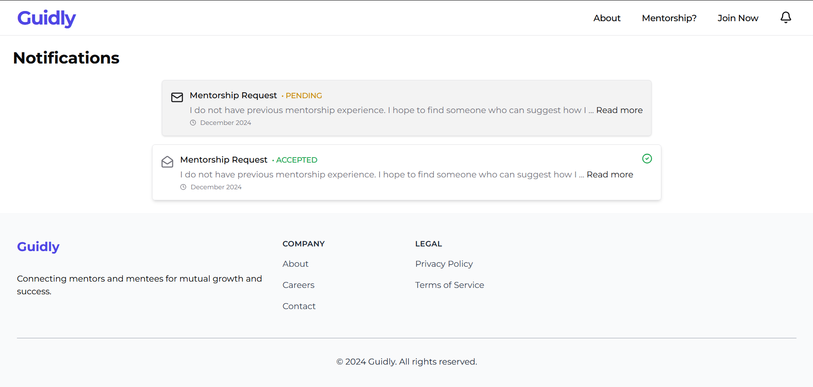
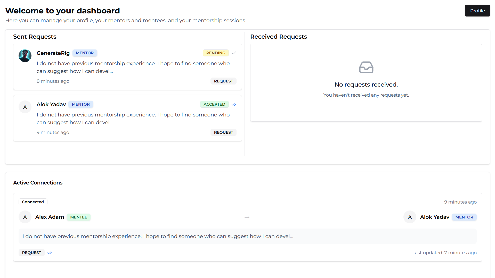
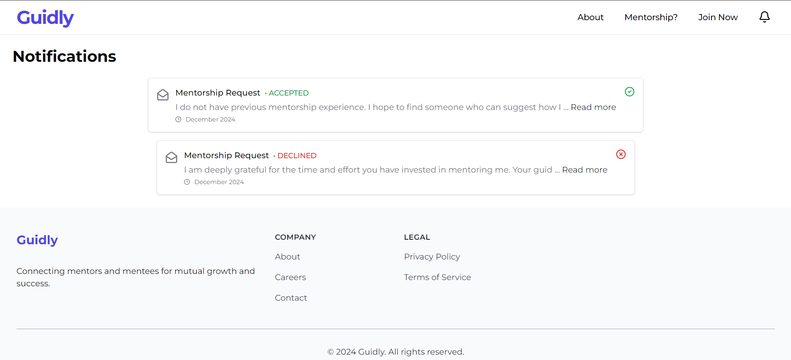
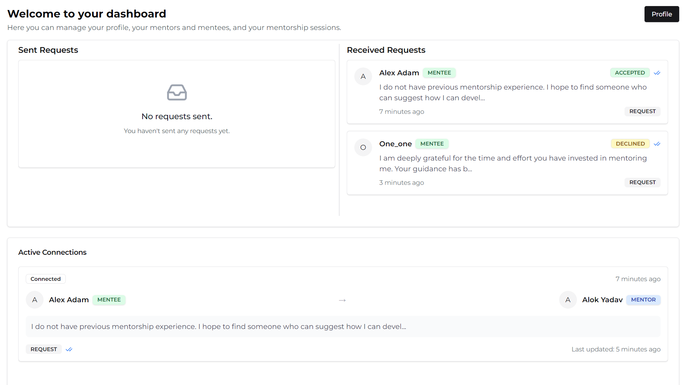
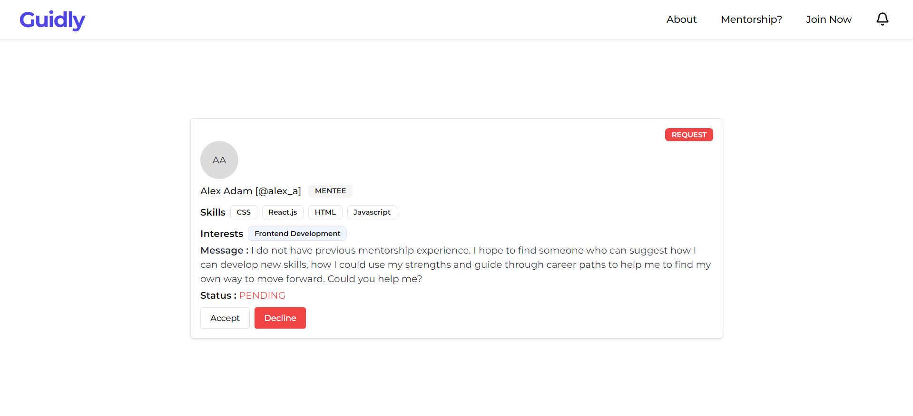

# Guidly

Welcome to **Guidly**, a platform designed to connect mentors and mentees based on skills and interests. This repository contains both the backend and frontend components of the application.

Live Demo: [guidly.vercel.app](https://guidly.vercel.app)

## Overview

Guidly is a platform that allows users to create profiles, find mentorship connections, and stay updated on mentorship requests and updates.

1. Home page: Welcome message and navigation links.

    

2. About page: Learn more about Guidly and its features.

    

3. Profile page: Delete or update user profiles with roles (mentor/mentee), skills, and interests.

    

4. Mentorship page: Find mentorship connections based on shared skills and interests.

    

## For Mentee

1. Notifications page: Stay updated on mentorship requests and updates.

    

2. Dashboard page: View sent and received mentorship requests.

    

## For Mentor

1. Notifications page: Stay updated on mentorship requests and updates.

    

2. Dashboard page: View sent and received mentorship requests.

    

3. Notification details page: View details of a specific notification and accept or reject the request.

    

## Features

### General Features

-   **User Authentication**: Secure login and registration.
-   **Profile Management**: Create and update user profiles with roles (mentor/mentee), skills, and interests.
-   **Mentorship Matching**: Find mentorship connections based on shared skills and interests.
-   **Notifications**: Stay updated on mentorship requests and updates.

### Backend Features

-   Built with **Express**, **Prisma**, and **TypeScript**.
-   Database management using **PostgreSQL**.
-   Implements secure authentication using **JWT** and **bcrypt**.
-   Robust data validation with **Zod**.

### Frontend Features

-   Built using **Vite**, **TypeScript**, and **Tailwind CSS**.
-   Engaging animations powered by **Framer Motion**.
-   Reusable UI components styled with **shadcn**.
-   Fully responsive and mobile-friendly design.

## Tech Stack

### Backend

-   **Express**: Backend framework.
-   **TypeScript**: For static typing and reliability.
-   **Prisma**: ORM for PostgreSQL database.
-   **JWT**: Secure user authentication.
-   **Zod**: Schema-based data validation.

### Frontend

-   **Vite**: Fast and modern frontend build tool.
-   **TypeScript**: Ensures robust and reliable code.
-   **Tailwind CSS**: Utility-first CSS framework for styling.
-   **Framer Motion**: Declarative animations for better user experience.
-   **shadcn**: Pre-styled and customizable UI components.

## Installation

### Prerequisites

-   **Node.js**: Install the latest version (v16 or higher).
-   **PostgreSQL**: Set up a PostgreSQL database.

### Steps

1. **Clone the repository**:

    ```bash
    git clone https://github.com/alok-x0s1/Guidly.git
    cd Guidly
    ```

2. **Install dependencies**:

    ```bash
    cd backend && npm install
    cd ../frontend && npm install
    ```

3. **Set up environment variables**:

    Refer to the [backend README](/server/README.md) and [frontend README](/client/README.md) for environment variable setup instructions.

4. **Set up the database**:

    Navigate to the backend directory:

    ```bash
    cd backend
    npx prisma migrate dev
    npx prisma generate
    ```

5. **Run the application**:

    Start the backend:

    ```bash
    cd backend
    npm run dev
    ```

    Start the frontend:

    ```bash
    cd frontend
    npm run dev
    ```

6. **Access the application**:

    Open your browser and navigate to `http://localhost:5173` (or the port Vite is running on).

## API Endpoints

Refer to the [backend README](/server/README.md) for detailed API documentation.

## Contributing

1. Fork the repository.
2. Create a new branch (`git checkout -b feature-name`).
3. Commit your changes (`git commit -m 'Add new feature'`).
4. Push to the branch (`git push origin feature-name`).
5. Open a pull request.
